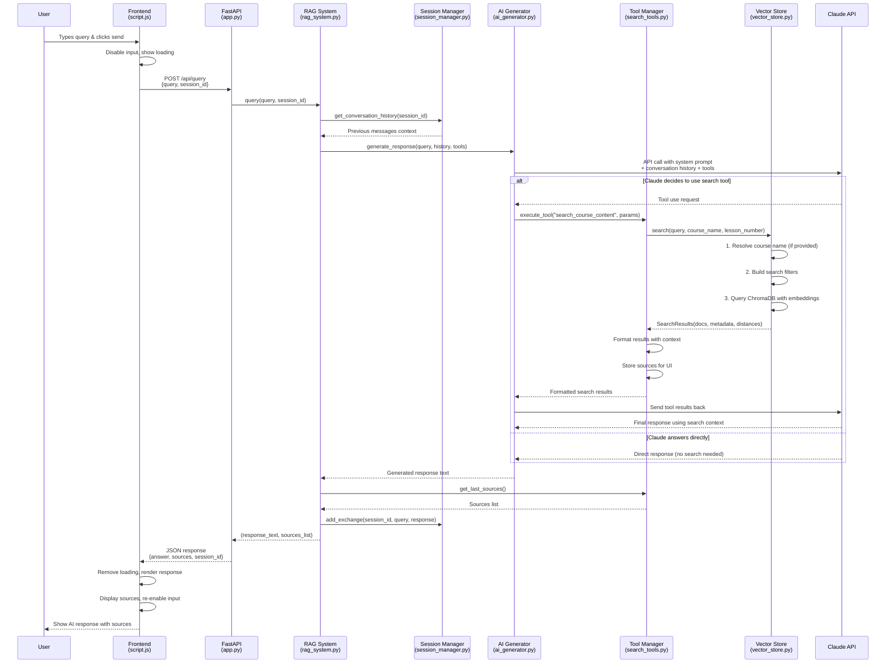

# RAG System Query Flow Diagram



## Key Components Flow


## Data Flow Architecture


## Search Process Detail

```mermaid
flowchart TD
    A[Search Tool Triggered] --> B[Vector Store Search]
    B --> C{Course Name<br/>Provided?}
    
    C -->|Yes| D[Resolve Course Name<br/>Semantic Matching]
    C -->|No| E[Skip Resolution]
    
    D --> F[Build ChromaDB Filter]
    E --> F
    
    F --> G{Lesson Number<br/>Provided?}
    G -->|Yes| H[Add Lesson Filter]
    G -->|No| I[Content Collection Query]
    H --> I
    
    I --> J[Embedding Search<br/>Similarity Matching]
    J --> K[Return Top Results<br/>Max 5 chunks]
    K --> L[Format with Context<br/>[Course - Lesson] Content]
    L --> M[Store Sources for UI]
    M --> N[Return to Claude]
```